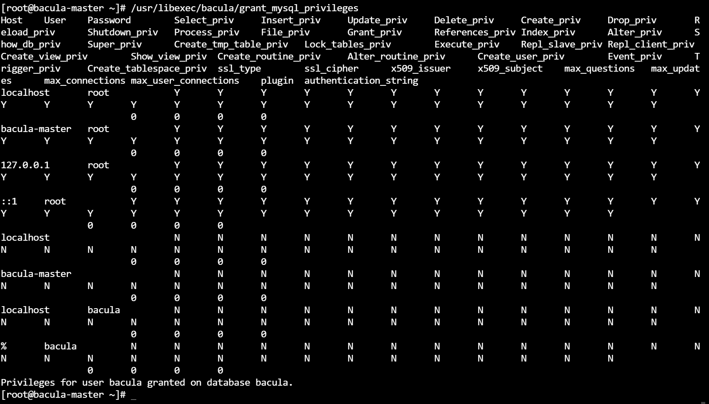

## Bacula Lab


## Step 1: set up the machine 
```bash
# setting up the machine
hostnamectl set-hostname bacula-master;
sed -i 's/^SELINUX=.*$/SELINUX=disabled/g' /etc/selinux/config;
setenforce 0;
systemctl stop firewalld; 
systemctl disable firewalld;
su;
```

## Step 2: install and configure the backup server
```bash
# install the packages
yum install -y bacula-director bacula-storage bacula-console bacula-client mariadb-server nano httpd;

# start and enable the mariadb services
systemctl enable mariadb;
systemctl start mariadb;
systemctl status mariadb

# execute the files
# Privileges for user bacula granted on Mysql database
/usr/libexec/bacula/grant_mysql_privileges
# creating database in mysql
/usr/libexec/bacula/create_mysql_database -u root
/usr/libexec/bacula/make_mysql_tables -u bacula

# start mysql_secure installation
mysql_secure_installation

# Set MySQL Lib to use Bacula 
alternatives --config libbaccats.so

# create the following directories
mkdir -p /bacula/backup /bacula/restore

# change ownership of the directory
chown -R bacula:bacula /bacula
chmod -R 700 /bacula

# edit the Hosts ile
echo "10.10.10.183 backup.hpcsa.in" >> /etc/hosts 

# 
```





## Step 3: edit the conf file
```bash
# edit the conf file & change the password
vi /etc/bacula/bacula-dir.conf
    -> Password = "root"

bacula-sd -tc /etc/bacula/bacula-sd.conf
 
# start the bacula-dir services
systemctl enable bacula-dir;
systemctl start bacula-dir;
systemctl status bacula-dir  
# start the bacula-sd services
systemctl enable bacula-sd;
systemctl start bacula-sd;
systemctl status bacula-sd 
# start the bacula-fd services
systemctl enable bacula-fd;
systemctl start bacula-fd;
systemctl status bacula-fd 

```


## Step 4: run the bconsole
```bash

```


