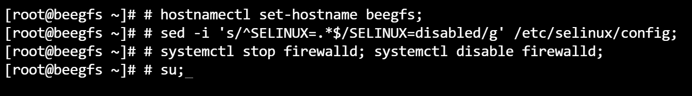
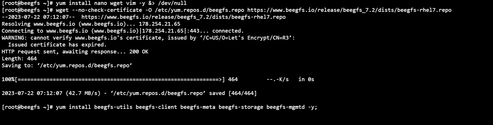
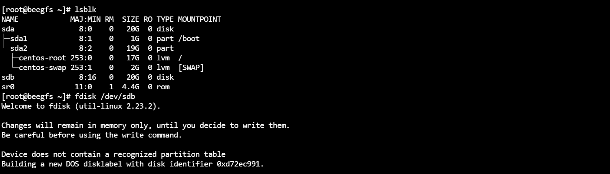
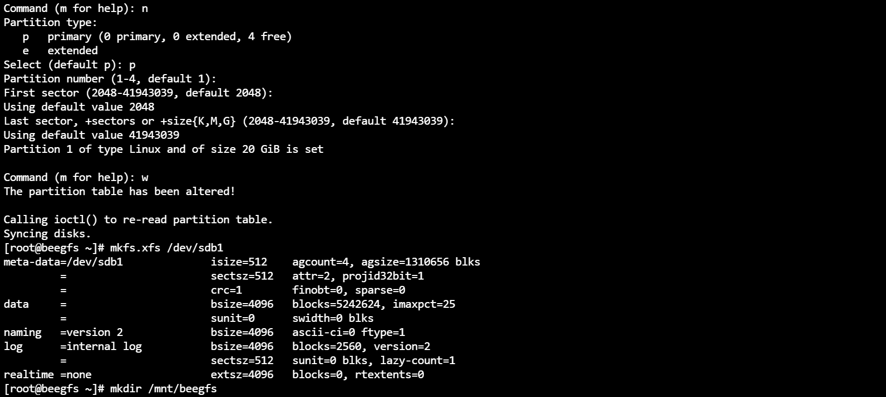
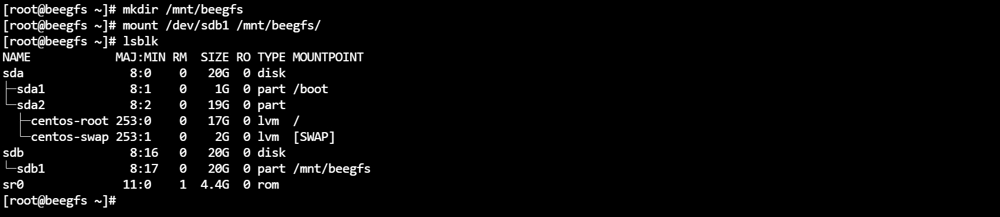
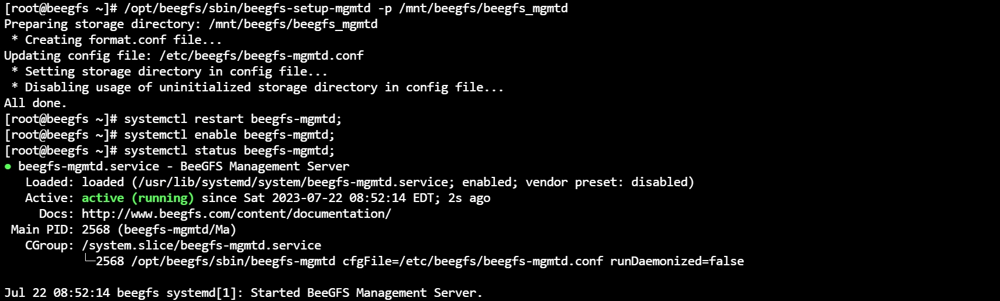
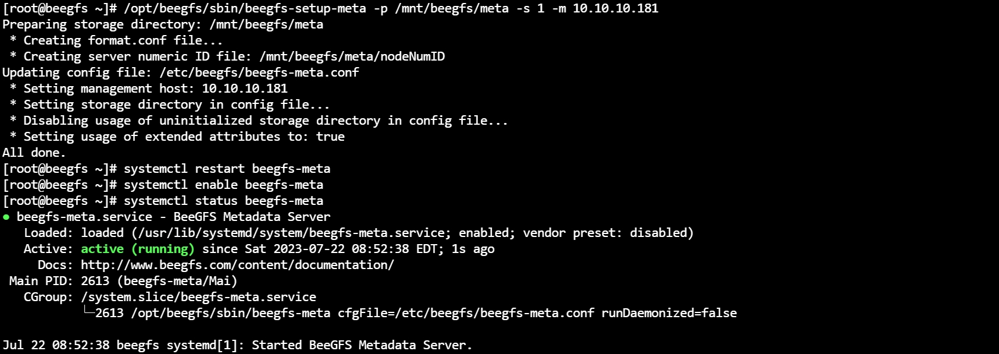

## Installation of BeeGFS
.png)

### Step 1: setting up the machine
```bash
# setting up the machine
hostnamectl set-hostname beegfs;
sed -i 's/^SELINUX=.*$/SELINUX=disabled/g' /etc/selinux/config;
systemctl stop firewalld; systemctl disable firewalld;
su;
```


### Step 2: installing the packages
```bash
# installing the package
yum install nano wget vim -y &> /dev/null
wget --no-check-certificate -O /etc/yum.repos.d/beegfs.repo https://www.beegfs.io/release/beegfs_7.2/dists/beegfs-rhel7.repo
yum install beegfs-utils beegfs-client beegfs-meta beegfs-storage beegfs-mgmtd -y;
mkdir -p /mnt/beegfs/meta;
mkdir -p /mnt/beegfs/storage;
mkdir -p /mnt/beegfs/beegfs_mgmtd;
```


### Step 3: mounting the disk
```bash
# listing the blocks
lsblk
# create partion
fdisk /dev/sdb
-> n
-> enter
-> enter
-> w
# format the disk
mkfs.xfs /dev/sdb1
# create a folder in /mnt/ folder
mkdir /mnt/beegfs
# mount the disk
mount /dev/sdb1 /mnt/beegfs
```




### Step 4: setting up the beegfs-mgmtd server
```bash
# edit the config file
vim /etc/beegfs/beegfs-client.conf
	# add ip of the beegfs-master to conf file
	-> sysMgmtdHost = 10.10.10.181
# setup the path for the beegfs-mgmtd server
/opt/beegfs/sbin/beegfs-setup-mgmtd -p /mnt/beegfs/beegfs_mgmtd
# start the services
systemctl start beegfs-mgmtd;
systemctl enable beegfs-mgmtd;
systemctl status beegfs-mgmtd;
```


### Step 5: setting up the beegfs-meta server
```bash
# setup the path for the beegfs-meta
/opt/beegfs/sbin/beegfs-setup-meta -p /mnt/beegfs/meta -s 1 -m 10.10.10.181    
systemctl start beegfs-meta
systemctl enable beegfs-meta
systemctl status beegfs-meta
```

### Step 6: setting up the beegfs-storage server
```bash
# setup the path for the beegfs-storage
/opt/beegfs/sbin/beegfs-setup-storage -p /mnt/beegfs/storage -s 2 -i 1 -m 10.10.10.181;
systemctl start beegfs-storage;
systemctl enable beegfs-storage;
systemctl status beegfs-storage;
```


