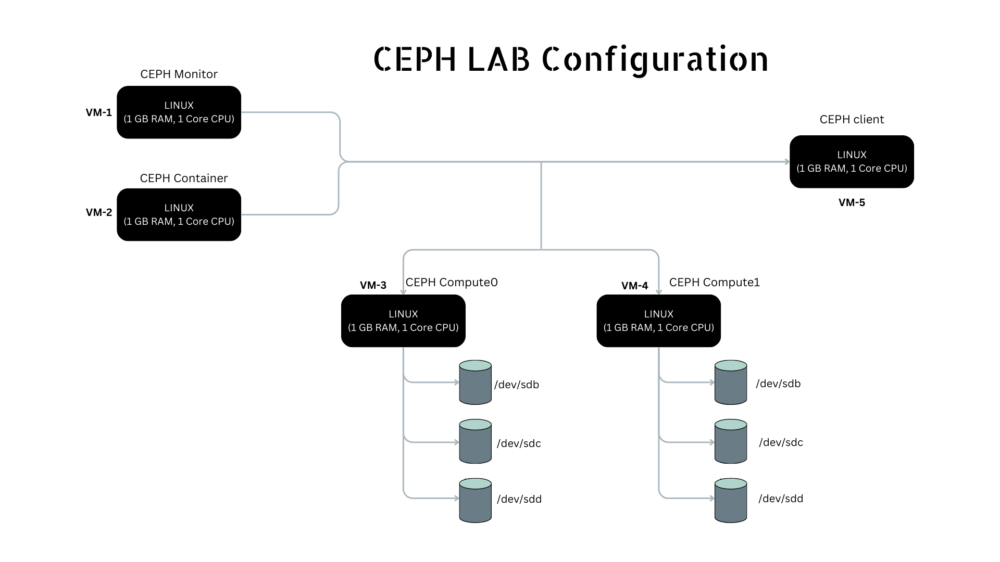

# Ceph introduction
```
-> ceph is unified distributed storage system designed for excellent
performance, reliablity and scalablity

-> ceph's design is based on the RADOS software which provides the ability to build a distributed storage system without a single point failure

-> software defined storage
-> ceph can hangle vast amount of data, therefore can also be used with data-intensive application like scientific data processing and media streaming
-> uses CRUSH(Controlled  Replication Under Scalable Hashing) algorithm,which enables ceph to scale,rebalance and recovers automatically

```


# Ceph lab configurations


---
# step 1: setting up the machines
```bash
# setting up the monitor
hostnamectl set-hostname ceph-monitor
setenforce 0;
sed -i --follow-symlinks 's/SELINUX=enforcing/SELINUX=disabled/g' /etc/sysconfig/selinux
systemctl stop firewalld;
systemctl disable firewalld;
su;

# setting up the controller
hostnamectl set-hostname ceph-controller
setenforce 0;
sed -i --follow-symlinks 's/SELINUX=enforcing/SELINUX=disabled/g' /etc/sysconfig/selinux
systemctl stop firewalld;
systemctl disable firewalld;
su;

# setting up the client
hostnamectl set-hostname ceph-client
setenforce 0;
sed -i --follow-symlinks 's/SELINUX=enforcing/SELINUX=disabled/g' /etc/sysconfig/selinux
systemctl stop firewalld;
systemctl disable firewalld;
su;

# setting up the compute01
hostnamectl set-hostname ceph-compute01
setenforce 0;
sed -i --follow-symlinks 's/SELINUX=enforcing/SELINUX=disabled/g' /etc/sysconfig/selinux
systemctl stop firewalld;
systemctl disable firewalld;
su;

# setting up the compute02
hostnamectl set-hostname ceph-compute02
setenforce 0;
sed -i --follow-symlinks 's/SELINUX=enforcing/SELINUX=disabled/g' /etc/sysconfig/selinux
systemctl stop firewalld;
systemctl disable firewalld;
su;


# copy the host file to other machines from controller
scp /etc/hosts root@controller:/etc/hosts
scp /etc/hosts root@compute1:/etc/hosts
scp /etc/hosts root@compute2:/etc/hosts
scp /etc/hosts root@client:/etc/hosts

# make entry in /etc/hosts on controller
cat << EOF >> /etc/hosts
10.10.10.170  controller.hpcsa.in controller
10.10.10.173  compute1.hpcsa.in compute1
10.10.10.172  compute2.hpcsa.in compute2
10.10.10.169  monitor.hpcsa.in monitor
10.10.10.171  client.hpcsa.in client
EOF
# creating user on cephadm on all users
ifup ens33
sudo yum install -y https://dl.fedoraproject.org/pub/epel/epel-release-latest-7.noarch.rpm
useradd cephadm && echo "cdac" | passwd --stdin cephadm
echo "cephadm ALL = (root) NOPASSWD:ALL" | sudo tee /etc/sudoers.d/cephadm
chmod 0440 /etc/sudoers.d/cephadm

# to configure chrony
yum install chrony
chronyc sourcestats


```

