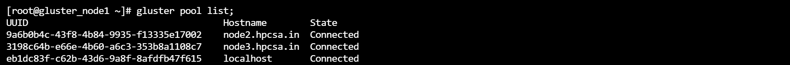

# Lab configurations

---

## Step 1 : setting up the machines
```bash
# setting up the client
hostnamectl set-hostname gluster_client;
setenforce 0;
sed -i 's/^SELINUX=.*$/SELINUX=disabled/g' /etc/selinux/config;
systemctl stop firewalld;
systemctl disable firewalld;
su;

# setting up the node1
hostnamectl set-hostname gluster_node1;
setenforce 0;
sed -i 's/^SELINUX=.*$/SELINUX=disabled/g' /etc/selinux/config;
systemctl stop firewalld;
systemctl disable firewalld;
su;

# setting up the node2
hostnamectl set-hostname gluster_node2;
setenforce 0;
sed -i 's/^SELINUX=.*$/SELINUX=disabled/g' /etc/selinux/config;
systemctl stop firewalld;
systemctl disable firewalld;
su;

# setting up the node3
hostnamectl set-hostname gluster_node3;
setenforce 0;
sed -i 's/^SELINUX=.*$/SELINUX=disabled/g' /etc/selinux/config;
systemctl stop firewalld;
systemctl disable firewalld;
su;

# make host file
cat << EOF >> /etc/hosts
> 10.10.10.165 client.hpcsa.in client
> 10.10.10.166 node1.hpcsa.in node1
> 10.10.10.167 node2.hpcsa.in node2
> 10.10.10.168 node3.hpcsa.in node3
> EOF;
```


# create a gluster file server
```bash
# run on all 3 mahines
    # turn on the interface
    ifup ens33

    # install the packages
    yum install wget epel-release centos-release-gluster -y;
    yum install glusterfs-server -y;

    # star the services
    systemctl start glusterd;
    systemctl enable glusterd;
    systemctl status glusterd;

# add peers of the servers to node1
gluster peer probe node2.hpcsa.in;
gluster peer probe node3.hpcsa.in;

# to check status of the glusterfs
gluster peer status;
gluster pool list;
```




# create a gluster volume
```bash
# create a directory
mkdir /mnt/disk1/diskvol

# mount the hdd
fdisk /dev/sdb;
mkfs.xfs /dev/sdb1;
mkdir /mnt/disk1;
mount /dev/sdb1 /mnt/disk1;
lsblk;

# create a volume
gluster volume create gdisk1 replica 3 node1.hpcsa.in:/mnt/disk1/diskvol/gdisk1 node2.hpcsa.in:/mnt/disk1/diskvol/gdisk1  node3.hpcsa.in:/mnt/disk1/diskvol/gdisk1

# start the volume   
gluster volume start gdisk1

```


