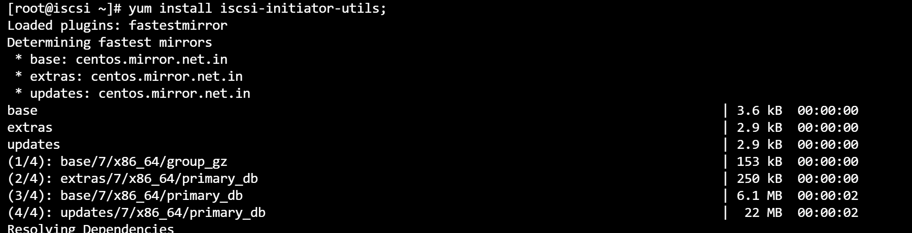
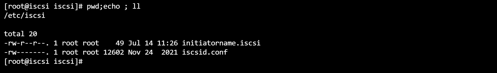
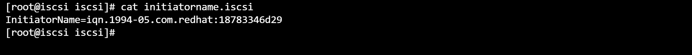

# Step 1: setup the machine on client
```bash
yum install iscsi-initiator-utils
cd /etc/iscsi/
# change client name if required
cat initiatorname.iscsi
systemctl restart iscsi
```




# Step 2: on iscsi server
> https://linux.die.net/man/8/iscsiadm
```bash
iscsiadm -m discovery -t st -p 192.168.112.167
iscsiadm -m discovery -t st -p 192.168.112.167 --login
iscsiadm -m session -P 3

fdisk /sda/sde
p
enter
enter
w


#add two 20GB HDD in VM
fdisk -l
pvcreate /dev/sdc /dev/sdb
vgcreate vg_iscsi /dev/sdb /dev/sdc
lvcreate -n lv_iscsi-disk-01 -l 1G vg_iscsi
lvcreate -n lv_iscsi-disk-01 -L 1G vg_iscsi
lvs
```
# Step 3: on iscsi server
```bash
#add two 20GB HDD in VM
fdisk -l
pvcreate /dev/sdc /dev/sdb
vgcreate vg_iscsi /dev/sdb /dev/sdc
lvcreate -n lv_iscsi-disk-01 -l 1G vg_iscsi
lvcreate -n lv_iscsi-disk-01 -L 1G vg_iscsi
lvs
```


