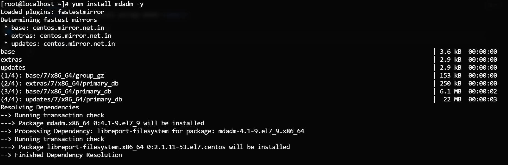
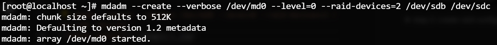
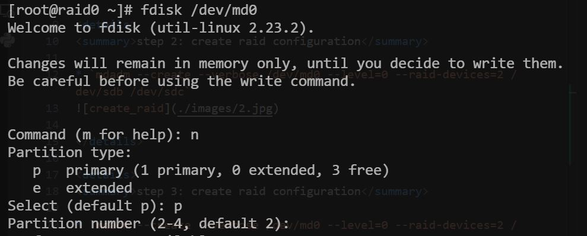
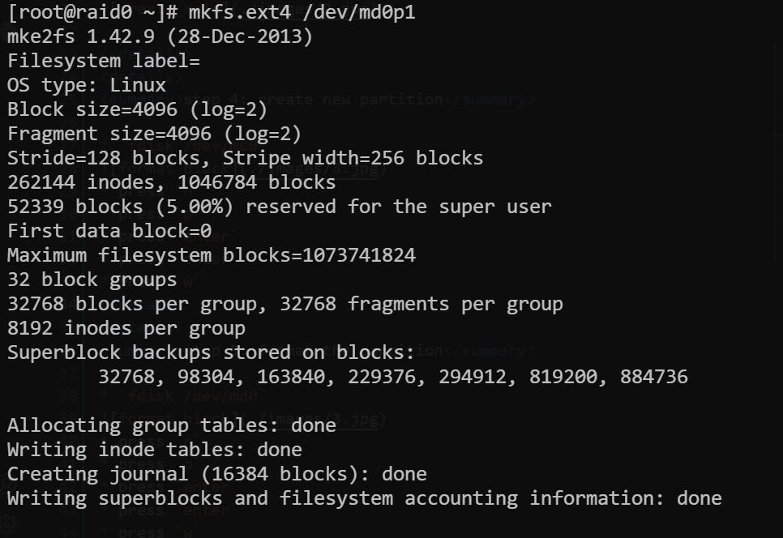
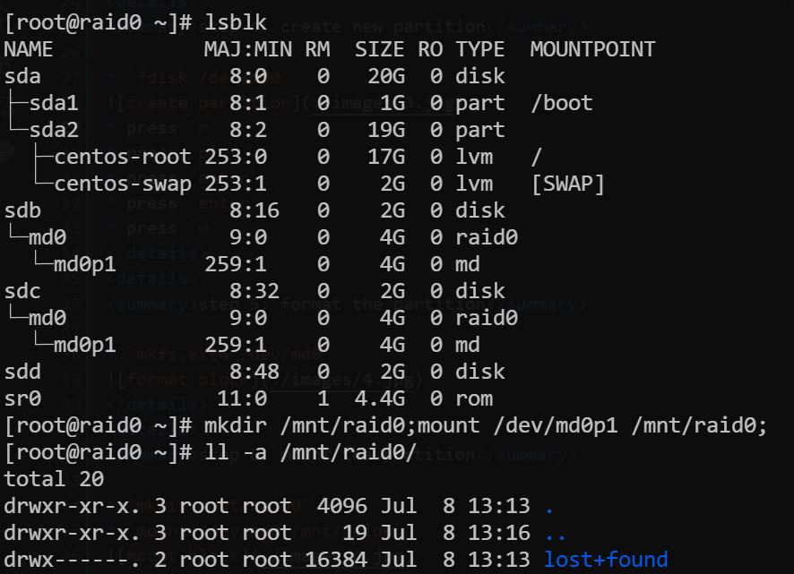
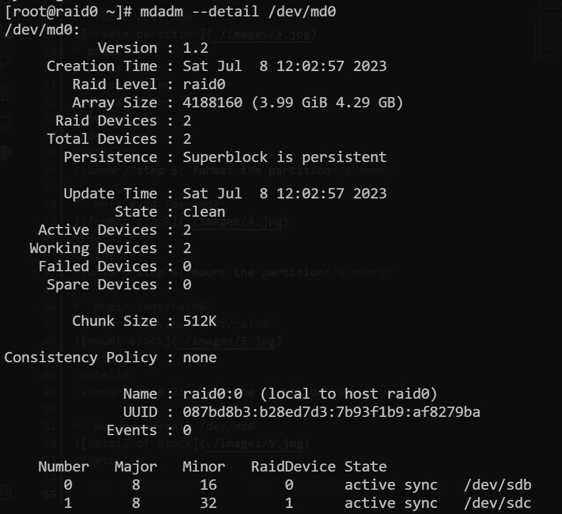

## step 1: install package mdadm

```
yum install mdadm -y
```
 


## step 2: create raid configuration

```
mdadm --create --verbose /dev/md0 --level=0 --raid-devices=2 /dev/sdb /dev/sdc
```



## step 3: create raid configuration

```
mdadm --create --verbose /dev/md0 --level=0 --raid-devices=2 /dev/sdb /dev/sdc
```


## step 4: create new partition

```
fdisk /dev/md0
```

```
press n
press p
press enter
press enter
press w
```


## step 5: format the partition

```
mkfs.ext4 /dev/md0
```



## step 6: mount the partition

```
mkdir /mnt/raid0
mount /dev/md0 /mnt/raid0
```



## step 7: check the partition

```
mdadm --detail /dev/md0
```



