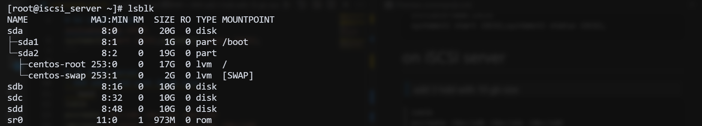
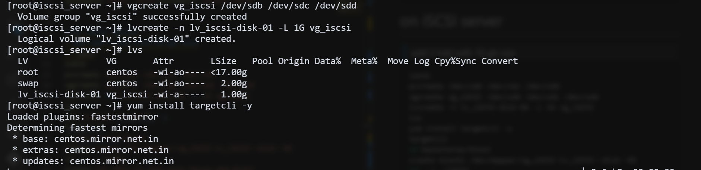
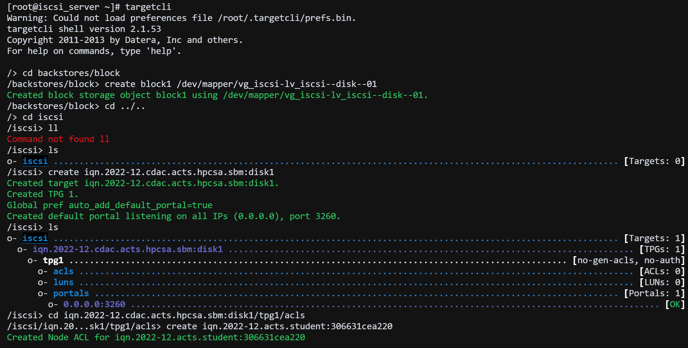
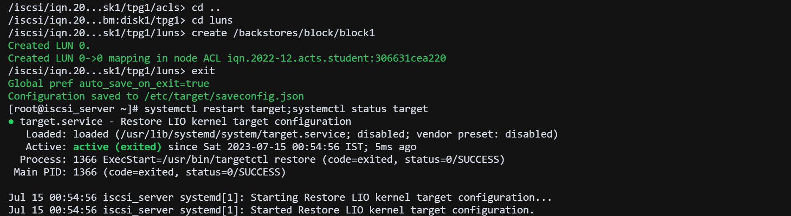
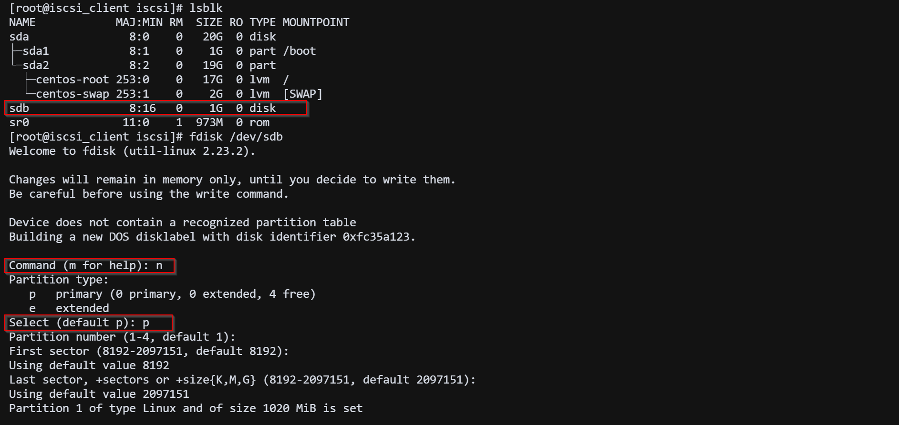
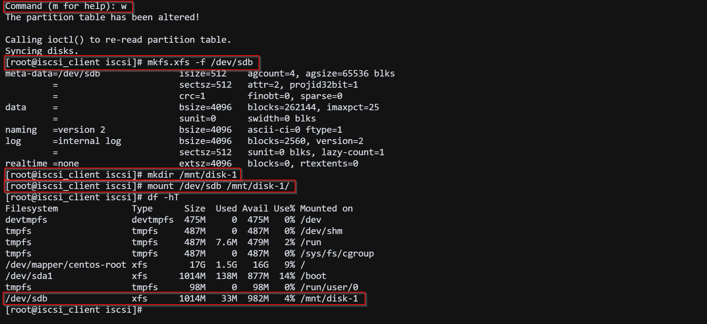

# On iSCSI client
```bash
yum install iscsi-initiator-utils -y
cd /etc/iscsi
echo InitiatorName=iqn.2022-12.acts.student:306631cea220 > initiatorname.iscsi
systemctl start iscsi;systemctl status iscsi;
```

# on iSCSI server
> ### add 3 hdd with 10 gb size
```bash
lsblk
pvcreate /dev/sdb /dev/sdc /dev/sdd
vgcreate vg_iscsi /dev/sdb /dev/sdc /dev/sdd
lvcreate -n lv_iscsi-disk-01 -L 1G vg_iscsi
lvs
yum install targetcli -y
targetcli
cd backstores/block
create block1 /dev/mapper/vg_iscsi-lv_iscsi--disk--01
cd ../../iscsi
create iqn.2022-12.cdac.acts.hpcsa.sbm:disk1
cd iqn.2022-12.cdac.acts.hpcsa.sbm:disk1/tpg1/acls
create iqn.2022-12.acts.student:306631cea220
cd ..
cd iqn.2022-12.cdac.acts.hpcsa.sbm:disk1/tpg1/luns
create /backstores/block/block1
exit

# now start the target service
systemctl start target;systemctl status target
```






## On iSCSI client
```bash

# iscsiadm -m discovery -t st -p [server_ip] --login
iscsiadm -m discovery -t st -p 192.168.64.144 --login

# check if volume is mapped or not
lsblk

# use X=iscsi mount disk
fdisk /dev/sdb
    -> press n
    -> press p
    -> press enter
    -> press enter
    -> press w

# check if volume is mapped or not
fdisk -l

# create a folder to mount the iscsi disk
mkdir /mnt/disk-1

# format the disk
mkfs.xfs -f /dev/sdb

# mount the disk
mount /dev/sdb /mnt/disk-1/

# check if mounted disk is visible or not
df -Th

```


