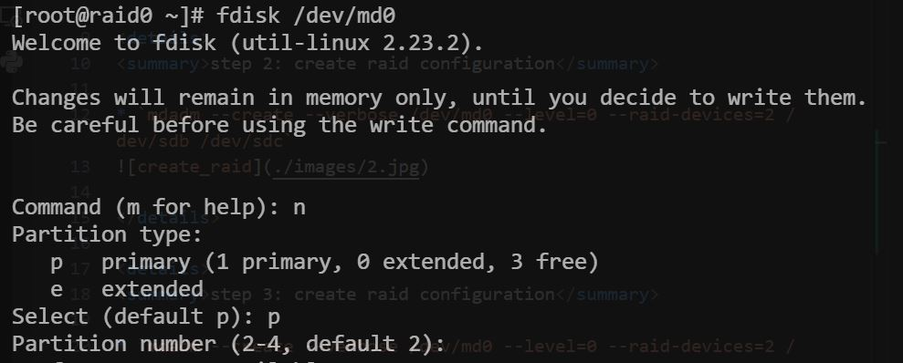
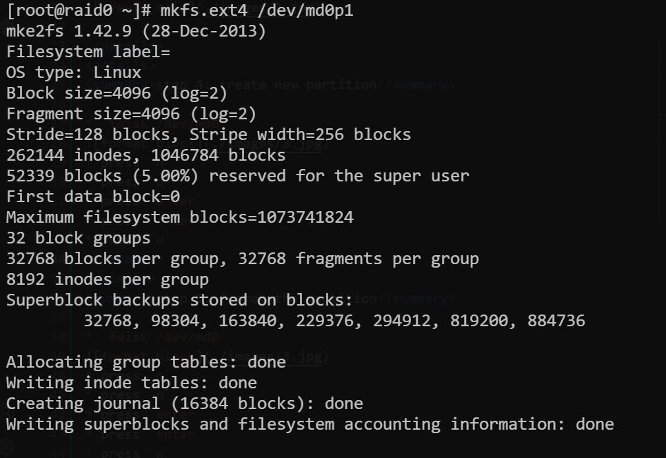
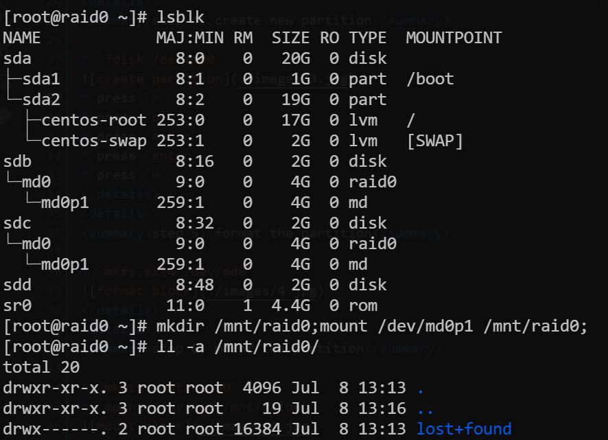
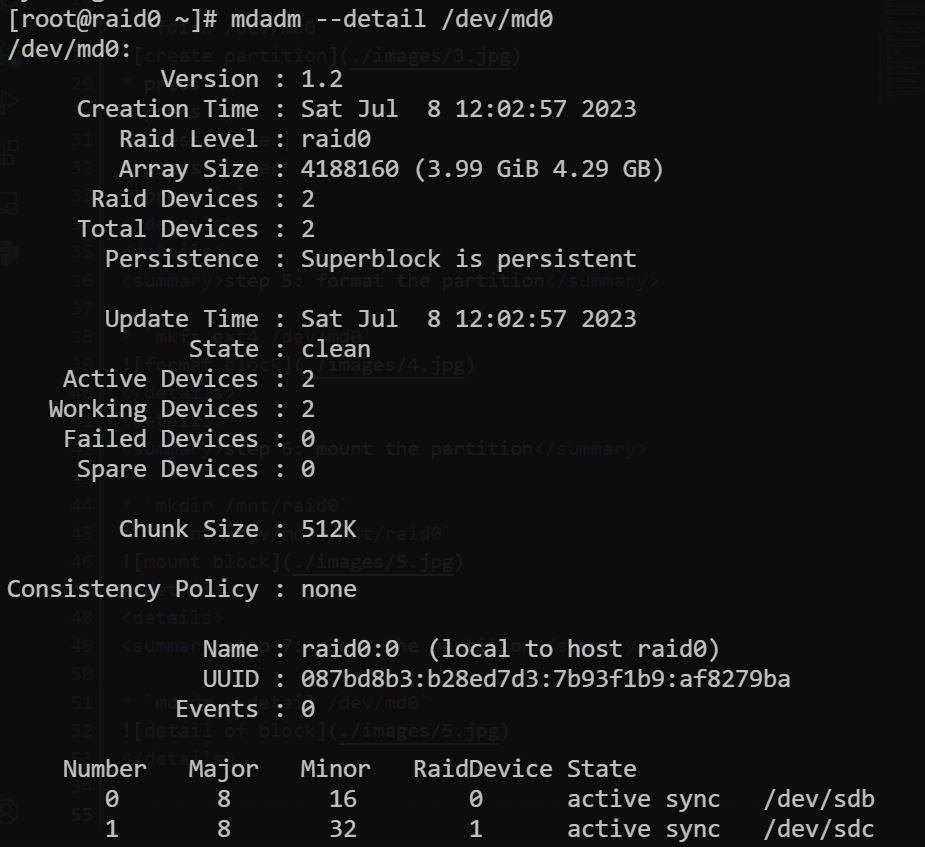

step 1: install package mdadm

* `yum install mdadm -y`

step 2: create raid configuration

* `mdadm --create --verbose /dev/md0 --level=0 --raid-devices=2 /dev/sdb /dev/sdc`

step 3: create raid configuration

* `mdadm --create --verbose /dev/md0 --level=0 --raid-devices=2 /dev/sdb /dev/sdc`

step 4: create new partition

* `fdisk /dev/md0`

* press `n`
* press `p`
* press `enter`
* press `enter`
* press `w`

step 5: format the partition

* `mkfs.ext4 /dev/md0`

step 6: mount the partition

* `mkdir /mnt/raid0`
* `mount /dev/md0 /mnt/raid0`

step 7: check the partition

* `mdadm --detail /dev/md0`

