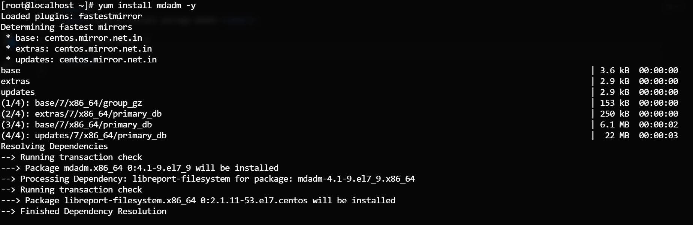
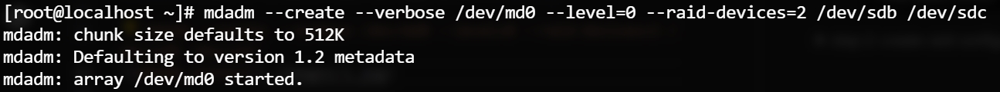

step 1: install package mdadm

* `yum install mdadm -y`

step 2: create raid configuration

* `mdadm --create --verbose /dev/md0 --level=0 --raid-devices=2 /dev/sdb /dev/sdc`

step 3: create raid configuration

* `mdadm --create --verbose /dev/md0 --level=0 --raid-devices=2 /dev/sdb /dev/sdc`

